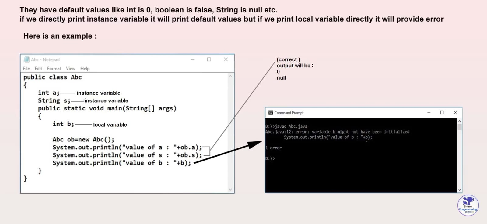

# Java Variables

A Java variable is a piece of memory that can contain a data value. A variable thus has a data type. Variables are typically used to store information which your Java program needs to do its job. A variable's value can be changed.

## Types of Variables
1. **Local Variables**
2. **Instance (Global) Variables**
3. **Static Variables**

### Local Variables
- **Declaration:** Inside methods, constructors, or blocks.
- **Scope:** Inside the method, constructor, or block where they are declared and cannot be accessed outside.
- **Allocation:** Memory is allocated when the method, constructor, or block is executed, and the variable is destroyed when it exits.
- **Stored Memory:** Stack memory.
- **Default Values:** Local variables do not have default values; a value should be provided before use.
- **Access Specifiers:** Cannot be used with local variables.

### Instance (Global) Variables
- **Declaration:** Inside the class but outside methods, constructors, or blocks.
- **Scope:** Inside all methods, blocks, and constructors within a class (not directly inside static methods).

- **Allocation:** Memory is allocated when an object is created. When the object is destroyed, the variable releases memory.
- **Stored Memory:** Heap memory.
- **Default Values:** They have default values, such as `int` is 0, `boolean` is false, `String` is `null`, etc.

- **Access Specifiers:** Can be used with instance variables.
- **How to Access:** 
  - Directly
  - From a static method: `A ob = new A(); ob.a;`

### Static Variables
- **Declaration:** With the `static` keyword in a class but outside a method, constructor, or block.
- **Scope:** Similar to instance variables, including within static methods.
- **Allocation:** Memory is allocated when the program runs and the `.class` file is loaded. When the class file gets unloaded, the variables are destroyed.
- **Stored Memory:** Non-heap memory or static memory.
- **Default Values:** Similar to instance variables.
- **Access Specifiers:** Can be used with static variables.
- **How to Access:**
  1. Directly
  2. By using the class name: `A.b`
  3. By using an object reference name

